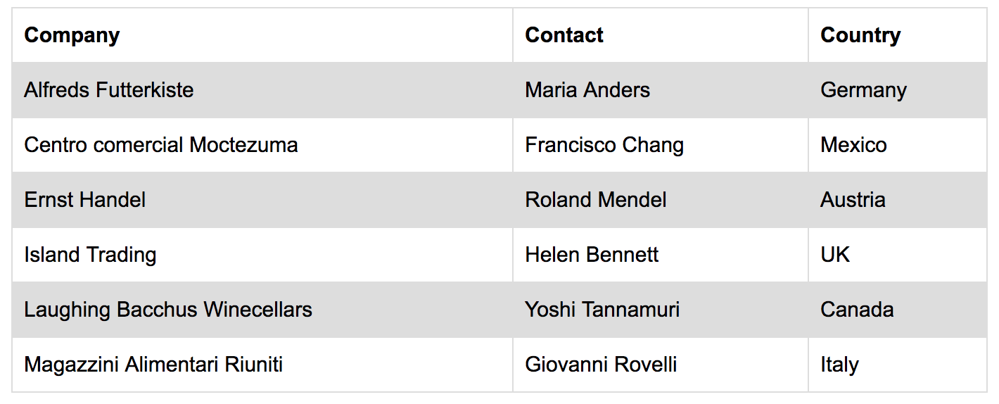

### Table component
Table component is a component that display data in tabular-way. 
The criteria's of the table component is
- reusable
- customizable 
- extendable

### Reusable
It's very important to create reusable component that strictly follow the rules
- component have to be isolated
- component to be free from app-specific

#### isolated
The objective of isolation is to ensure component developed didn't override other components
and the component scope never exposed to the outsider and prevent it to be overrided.

#### free from app-specific
Abusing code with app-specific always exposing coding into conditional way.

Here is the simple illustration:

```js
 if (invoker === 'app1') {
     return (<table className='app1' />)
 } else if (invoker === 'app2') {
     return (<table className='app2' />)
 } else if ...
```

Every invocation of the component will go thru the pipeline of conditionals. If more apps use the component, more conditionals need to be go thru. Hard to read and hard to maintaining it.


### Customizable
Often Ui developer choose to develop configurable Ui in order to support customization. I'm one of them. This is a sample illustration the idea of configurable Ui:

```js
const table = new ConfigUi({
    type: 'multiSelect',
    theme: 'dark',
    items: [
        { type: 'row', items: [ { type: 'col', value: 'Td' } ] }
    ]
    ...
})
```

However above pattern not really suit for React/JSX that aim to cater on the markup instead.
Then, what is the suitable pattern for configurable Ui in React/JSX?

Let's try to convert above code into JSX:

```jsx
<TableComponent multiSelect dark>
    <TableComponentRow>
        <TableComponentCell>
            ...
        </TableComponentCell>
    </TableComponentRow>
</TableComponent>
```

> TableComponent

```js
const { children } = this.props;
return (
    <Table>
        {children}
    </Table>
)
```

> TableComponentRow

```js
const { children } = this.props;
return (
    <tr>
        {children}
    </tr>
)
```

> TableComponentComponent

```js
const { children } = this.props;
return (
    <td>
        {children}
    </td>
)
```

Everything look good BUT above JSX pattern has one challenge that we need to deal with.
I will cover the challenge and the solution after we done with "extendable" part.

### Extendable
In Human JavaScript book, the author give the best reason to uncoupled reusable stuff with the invokers:

> it's very easy to fall into the trap of tightly coupling your application to 
> that particular client.This makes it much harder to build other clients, 
> say, for example, an iOS app for your app. 
> While these frameworks are useful for standard desktop web apps, they let us down a bit 
> when we want to go beyond that. With more and more talk of "the Internet of things" 
> we have good reason to believe that the breadth of device types that want 
> to talk to your app will continue to increase

One way to decoupled the component with the app is to provide a way for the app to extend the component. Here is illustration on providing extendable component.

```js
const NewTableComponent = Extend(TableComponent, {
    items: [...],
    theme: `
        table {
            border: 2px solid ${colorTheme}
        }
    `;
})
```

As promise, let is go thru the challenge by applying configurable pattern on the markup (JSX).
The challenge is how to manage communication (passing props & state) between TableComponent and it's nested components.

Let take the below code as an example:

```jsx
<TableComponent striped>
    <TableComponentRow>
        <TableComponentCell>
            ...
        </TableComponentCell>
    </TableComponentRow>
</TableComponent>
```

Here is the requirements:

- when striped prop added, row:even showed dark background color 
- while row:odd should light background color
- by default table rows showed white background color



We can easily tackle this by passing the prop "striped" to the TableComponentRow. However it is not always the "easy" thing is the "right" thing, especially on this case. It's ugly, i must admit it. No, WE must admit it.

```jsx
<TableComponent striped>
    <TableComponentRow striped>
        <TableComponentCell>
            ...
        </TableComponentCell>
    </TableComponentRow>
</TableComponent>
```

Its more ugly when all of the childrens of the Table need the "striped" prop:

```jsx
<TableComponent striped>
    <TableComponentRow striped>
        <TableComponentCell striped>
            ...
        </TableComponentCell>
    </TableComponentRow>
</TableComponent>
```

Some cool React developer solve the issue by using Cloning pattern and its not a bad pattern:

```js
const childWithProps = React.cloneElement(children, {striped: this.props.striped});
return (
    <Table>
        {childWithProps}
    </Table>
)
```

But what if the Table component have multiple type of childrens - TableRow, THead, TFoot and Caption?

```js
  const { striped } = this.props;
  const childArray = React.Children.toArray(children);
  const childrenWithProps = childArray.map((child, i) => {
    switch (child.type) {
      case 'TableRow':
        return React.cloneElement(child, {
          striped
        });
      case 'THead':
        return React.cloneElement(child, {
          striped
        });
       case 'TFoot':
        return React.cloneElement(child, {
          striped
        });
       case 'Caption':
        return React.cloneElement(child, {
          striped
        });
      default:
        return child;
    }
  });
```

Well, it is a lots of code. And when we have more props, more code need to be added.

As the title is "Finding the right pattern for Table component", Let is walkthorugh the Context API pattern. 

Context API pattern is the approach to have one Provider with multi-consumers who depends on the Provider to provide them the data. The data can be derived from the props and the state of the Provider.

Here is the sample Provider code:

```jsx
<Provider value={{dataFromProps, dataFromContext}}>
    {children}
</Provider>
```

And here is the sample Consumer code:

```jsx
<Consumer>
    {{(providerContext)}} => (
        {providerContext.dataFromProps}
    )
</Consumer>
```

Let is rewrite the Table code with Context API pattern:

Start with Table (Provider):

```jsx
<Table.Provider value={{striped}}>
    {children}
</Table.Provider>
```

And the Table consumers

```jsx
<Table.Consumer>
    {{(tableContext)}} => (
        <TableRow />
    )
</Table.Provider>
```

By wrapping in {{(tableContext)}}, all data that we throw in tableContext is available for the nested components.

THead:

```jsx
<Table.Consumer>
    {{(tableContext)}} => (
        <TableHead />
    )
</Table.Provider>
```

TFoot:

```jsx
<Table.Consumer>
    {{(tableContext)}} => (
        <TableFoot/>
    )
</Table.Provider>
```

Table nested components like TableCell, TableHeaderRow and TableHeaderCell can utilize the Table context. We don't have to worry about developing complex component with multi nested components anymore.